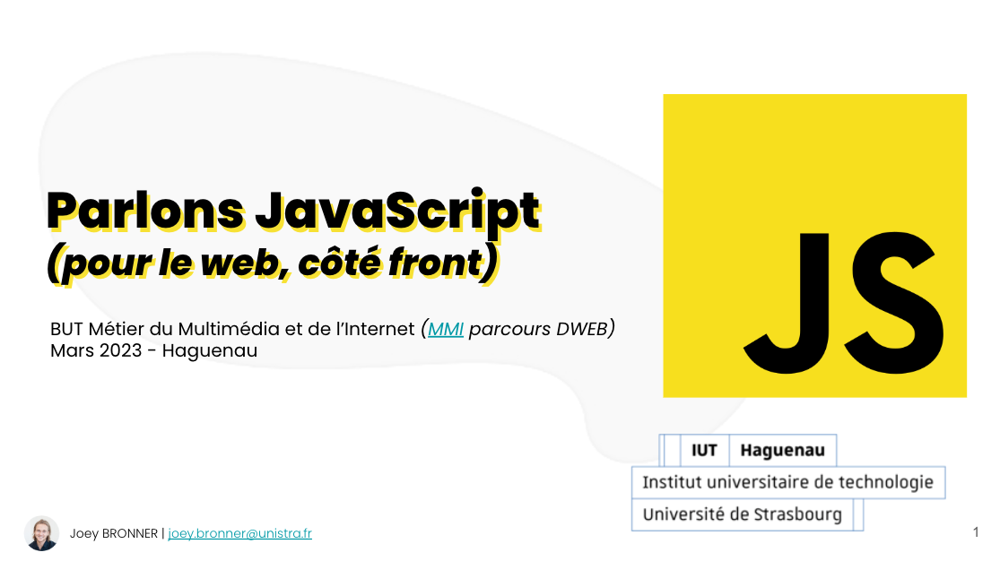

# MMI (DWeb) - Parlons JavaScript (pour le web, côté front)

Introduction au langage JavaScript

## Support de cours 📚

Pour suivre le cours, rendez-vous sur le Google Slide *(vous avez les droits pour commenter)* ci-dessous ⤵

- [**Google Slide - Parlons JavaScript (pour le web, côté front) - MMI Haguenau 22/23**](https://docs.google.com/presentation/d/1goo873roIrB1XM2IBHHWHALEKFIlmQFBhHT5_3Sv7Mg/edit?usp=sharing)

## TPs 🏋️

- [TP1-Carousel](TP/TP1-Carousel.md)
- [TP2-JustePrix](TP/TP2-JustePrix.md)
- [TP3-FetchUsers](TP/TP3-FetchUsers.md)

## Challenges 🎯

- [Challenge #1](./challenges/challenge1.md)
- [Challenge #2](./challenges/challenge2.md)
- [Challenge #3](./challenges/challenge3.md)
  
## Git 💻

- [Tuto Git](GIT.md)